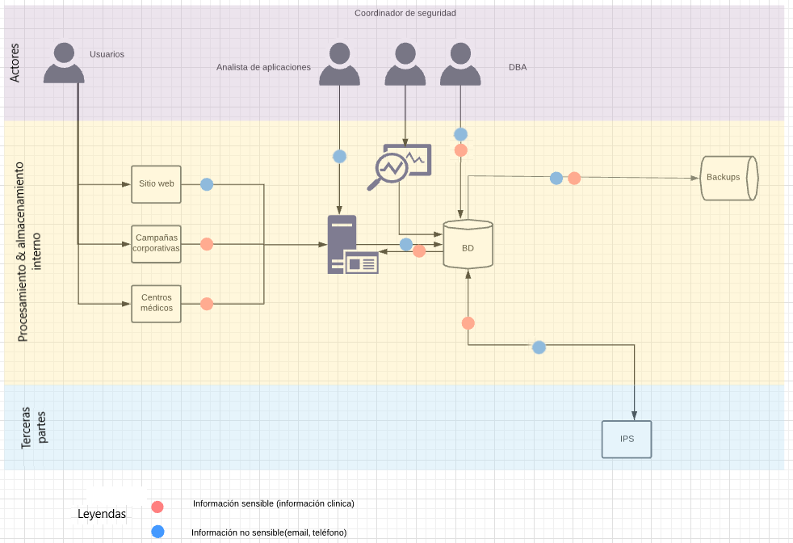

# FLUJO DE DATOS DE INFORMACIÓN

A continuación se relaciona la tabla con las personas que tienen autorización para conectarse a las bases de datos en un horario 7x24, la conexión será permitida únicamente desde el origen mencionado.

 Personal Autorizado  | Origen autorizado de conexión Red LAN  | Origen autorizado de conexión Externo | Datos de consulta
----------------------|:--------------------------------------:|:-------------------------------------:|:-----------------:
Administrador bases de datos (DBA)| 192.168.21.10 | VPN (site to client) | Todas las tablas
Análista de aplicaciones| 192.168.20.2 | VPN (site to client) | Tabla personas
Coordinador de seguridad| 192.168.22.4 | VPN (site to client) | N/A
Usuarios| N/A | VPN (site to client) | Todas las tablas

A continuación se relaciona el diagrama de flujo de datos establecido para Salud Capital.

