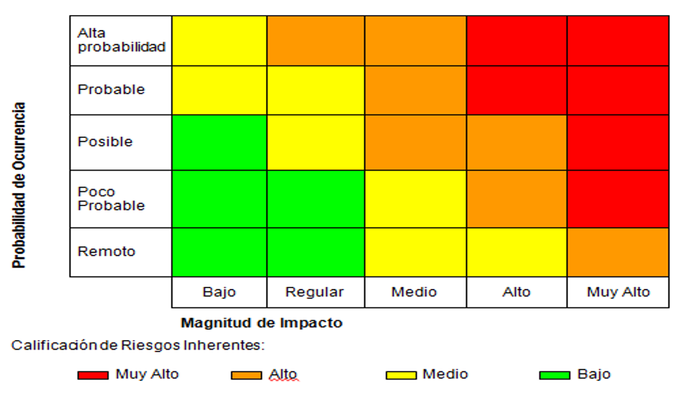
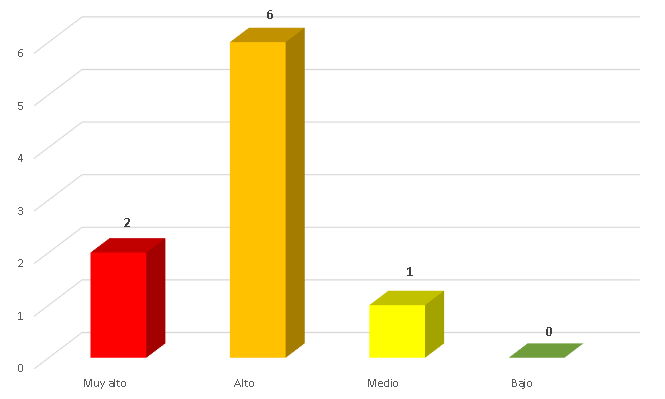

# GESTIÓN DE RIESGO

## Tabla de Contenido

* [METODOLOGÍA DE GESTIÓN DE RIESGOS](#metodología-de-gestión-de-riesgos)
  + [METRICAS DE PROBABILIDAD](#metricas-de-probabilidad)
  + [METRICAS DE IMPACTO](#metricas-de-impacto)
* [MATRIZ DE RIESGO](#matriz-de-riesgo)

 - - -

## METODOLOGÍA DE GESTIÓN DE RIESGOS

Se presenta la siguiente metodología de gestión de riesgos para la bases de datos de Salud Capital, acorde a los requerimientos y apetito de riesgo de la entidad.

### Metricas de Probabilidad

Probabilidad | Calificación | Descripción
-------------|:------------:|--------------
Alta Probabilidad | 5 | Ya esta ocurriendo o es muy probable que ocurra.
Probable	| 4 |	Se espera que ocurra este evento.
Posible	| 3 |	Puede ocurrir pero no siempre.
Poco probable	| 2 | Puede ocurrir en raras circunstancias.
Remoto	| 1 |	No se espera que ocurra o solo en circunstancias excepcionales.

### Metricas de Impacto

Se define como la magnitud de afectación que puede tener un evento sobre la entidad en caso de materializarse. Se desarrolla la siguiente tabla de calificación cualitativa y cuantitativa:

Impacto | Calificación | Seguridad | Financiero |	Reputacional |	Regulatorio | Continuidad
--------|:------------:|-----------|------------|----------------|--------------|--------------
Muy Alto|5|Perdida de confidencialidad, integridad o disponibilidad en datos completes de clientes|Perdida de un 30% de ganancia operativa|Perdida significativa de valor de la marca.|Sanciones penales por incumplimiento legal|Suspensión de actividades en todas las sedes y operaciones
Alto|4|Perdida de confidencialidad, integridad o disponibilidad en datos de la entidad|Perdida de un 20% de ganancia operativa|Perdida de valor de la marca.|Pago de indemnizaciones por incumplimiento legal.|Suspensión de actividades en una sede o actividad operativa
Medio|3|Perdida de confidencialidad, integridad o disponibilidad en datos parciales |Perdida de un 10% de ganancia operativa|Perdida de valor de la marca a corto plazo.|Pago de indemnizaciones por incumplimiento legal.|Suspensión de actividades en una sede o actividad operativo por un día
Regular|2|Perdida de confidencialidad, integridad o disponibilidad en datos no sensibles|Perdida de un 5% de ganancia operativa|Perdida menor de valor de la marca|Incumplimiento regulatorio sin aplicación de multas|Interrupción parcial de la operación
Bajo|1|Perdida de confidencialidad, integridad o disponibilidad en datos internos no sensibles|Perdida de un 1% de ganancia operativa|Perdida nula de valor de la marca o solo a nivel interno|Incumplimiento parcial regulatorio sin afectación de multas.|Interrupciones breves

### Clasificación del Riesgo Inherente

Se define la siguiente tabla de calificación de riesgo, con el fin de establecer el riesgo inherente teniendo en cuenta los valores de impacto y probabilidad:

Salud Capital decide asumir los riesgos que identificados en el nivel medio y bajo.

- - -

## MATRIZ DE RIESGO

A continuación se presentan los resultados del análisis y evalución de riesgos:

No.|Riesgo|Factor Generador|Probabilidad de Ocurrencia|Impacto|Nivel de Riesgo - Inherente
:-:|------|----------------|:------------------------:|:-----:|:--------------------------:
1|Perdida de integridad, confidencialidad o disponibilidad de la base de datos de capacitadores, hijos y enfermedades por asignacion de accesos inecesarios.|Recurso Humano|Probable|Alto|Muy alto
2|Perdida de integridad, confidencialidad o disponibilidad de la base de datos de capacitadores, hijos y enfermedades por abuso de privilegios administrativos.|Recurso Humano|Posible|Alto|Alto
3|Perdida de integridad, confidencialidad o disponibilidad de la base de datos de capacitadores, hijos y enfermedades por instalacion de malware.|Tecnología|Poco Probable|Alto|Alto
4|Perdida de trazabilidad, registro y monitoreo oportuno de actividad maliciosa realizada en la base de datos.|Procesos|Posible|Medio|Alto
5|Perdida de disponibilidad por la no ejecucion de respaldos periodicos de la informacion almacenada.|Procesos|Posible|Medio|Alto
6|Ataques informaticos exitosos por explotacion de vulnerabilidades no parchadas o parametros inseguros no asegurados.|Tecnología|Posible|Alto|Alto
7|Exposicion o fuga de informacion sensible de las bases de datos por no enmascaramiento o cifrado de la informacion.|Tecnología|Probable|Muy Alto|Muy alto
8|Perdida de disponbilidad por denegacion de servicio sobre la base de datos.|Tecnología|Poco Probable|Medio|Medio
9|Exposicion o fuga de informacion sensible de las bases de datos por uso de canales no cifrados de informacion.|Tecnología|Posible|Alto|Alto

Finalmente se presenta graficamente el resumen del análisis y evaluación de riesgos:

