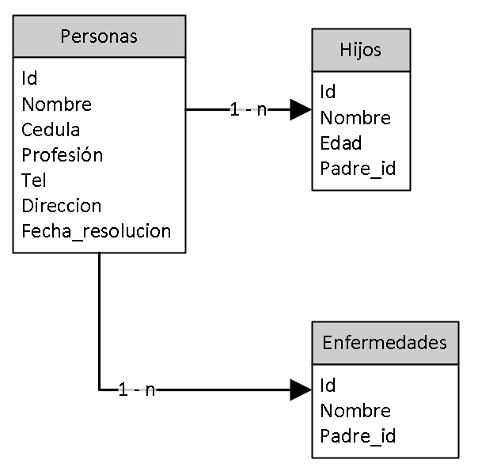

# Proyecto_Seguridad_BD_MSIC-1
Proyecto aplicacion controles framework de ciberseguridad de la NIST

## Tabla de Contenido

* [1. Contexto de la base datos](#1-contexto-de-la-base-datos)
  + [Tabla personas](#tabla-personas)
  + [Tabla hijo](#tabla-hijos)
  +  [Tabla enfermedades](#tabla-enfermedades)
* [2. Inventario (ID.AM-2)](#2-Inventario-idam-2)
* [3. Flujo de datos (ID.AM-3)](./Flujo_datos/Readme.md)
* [4. Clasificación (ID.AM-5)](./Clasificacion_Informacion/Readme.md)
* [5. Roles y responsabilidades (ID.AM-6)](./R&R/Readme.md)
* [6. Requerimientos legales (ID.GV-3)](./Requisitos_Legales/Readme.md)
* [7. Gestión de riesgos (ID.GV-4)](./Gestion_Riesgos/Readme.md)

 - - -

## 1. Contexto de la base datos

La line base de la información de la base de datos es tomada de la entidad Salud Capital o Secretaría Distrital de Salud Bogotá, la cual es la entidad rectora en salud en Bogotá D.C. responsable de garantizar el derecho a la salud a través de un modelo de atención integral e integrado y la gobernanza, para contribuir al mejoramiento de la calidad de vida de la población del Distrito Capital.

Como parte de su labor de orientar y liderar, Salud Capital usará su autonomia administrativa y financiera para la implementación de planes, políticas, programas y proyectos que conduzcan a garantizar el derecho a la salud de los habitantes del Distrito Capital.

La base datos se encuentra implementada en el motor Microsoft SQL Server y se compone de tres tablas las cuales son:

* Personas: Datos de capacitadores autorizados en manejo de alimentos.
* Hijos: Datos de hijos de los capacitadores autorizados en manejo de alimentos. 
* Enfermedades: Datos de enfermedades conocidas de los capacitadores autorizados en manejo de alimentos.

Considerando que dentro de la información manejada por Salud Capital pueden existir datos medicos o de salud, se acogerá como política interna el cumplimiento de la ley HIPAA de Estados Unidos, es espacial aquellos criterios relaciones con la seguridad de los datos. Adicionalmente, con el fin de comprender mejor la información registrada en la base de datos se presenta el diccionario de datos de las tablas existentes:

### Tabla Personas

Campo | Tipo | Nulo
----- | ---- | ----
Id | int (11) | No 
Nombre | varchar (100) | No
Cedula | varchar (20) | No
Profesion | varchar (100) | Si
Tel | int (12) | Si
Direccion | varchar (100) | Si
Fecha_resolucion | timestamp (100) | Si

### Tabla Hijos

Campo | Tipo | Nulo
----- | ---- | ----
Id | int (11) | No 
Nombre | varchar (100) | No
Edad | int (3) | Si
Padre_id | int (11) | No

### Tabla Enfermedades

Campo | Tipo | Nulo
----- | ---- | ----
Id | int (11) | No 
Nombre | varchar (100) | No
Padre_id | int (11) | No

Finalmente, para establecer la relación entre los datos se presenta un modelo entidad relación el cual se presenta en la siguiente imagen:

La información de la base datos puede encontrase en la carpeta ./BD

## 2. Inventario (ID.AM-2)

En busca de  mantener el inventario de bases de datos se realizarán principalmente dos actividades:

* Ejecución de busqueda de motores de bases de datos a través de puertos y servicios activos.
* Identificación manual de bases de datos para la ejecución de análisis de riesgos.
